# 🌱 Organic Farm Pest Management AI System

A streamlined, intelligent AI system for organic farmers that identifies agricultural pests through computer vision and provides OMRI-certified treatment recommendations with an intuitive 3-page interface.


[](https://opensource.org/licenses/MIT)

## 🚀 Quick Start

```bash
# Clone the repository
git clone https://github.com/ryangan28/Final-Project.git
cd Final-Project

# Install dependencies
pip install -r requirements.txt

# Download the Agricultural Pests Dataset
# Place it in the 'datasets/' directory

# Launch the application
python start.py
```

The application will automatically check dependencies and launch at `http://localhost:8501`

## ✨ Key Features

### 🔍 Advanced Pest Detection
- **EfficientNet-B0 Deep Learning**: High accuracy with ensemble of 5 models and uncertainty quantification
- **YOLOv8-nano Integration**: Fast object detection with pest-specific training
- **Multi-Backend System**: Graceful degradation from ML to simulation modes
- **12 Pest Classes**: Comprehensive coverage of common agricultural pests
- **Real-time Processing**: Optimized inference with CPU/GPU support
- **Model Selection**: Choose between different detection models for speed vs accuracy

### 💬 Conversational AI Assistant
- **LM Studio Integration**: Local LLM for privacy-preserving conversations
- **Context-Aware Responses**: Integrates pest detection results automatically
- **Agricultural Expertise**: Specialized prompts for farming scenarios
- **Offline Capability**: Works without internet connection
- **Quick Actions**: Pre-defined prompts for common farming questions

### 🌿 Organic Treatment Library
- **OMRI-Certified Solutions**: 100% organic-compliant treatments
- **IPM Principles**: Integrated Pest Management approach
- **Severity-Based Plans**: Scaled responses (low/medium/high)
- **Comprehensive Coverage**: Mechanical, biological, and cultural controls
- **Smart Navigation**: Context-aware library showing relevant treatments
- **Pest-Specific Mapping**: Automatic pest-to-treatment matching

### 📱 Streamlined User Interface
- **3-Page Design**: Focused workflow with Pest Identification, Chat Assistant, and Treatment Library
- **Mobile-Friendly**: Responsive design optimized for field use
- **Context-Aware Navigation**: Seamlessly transition between identification and treatments
- **Real-time Results**: Instant pest identification with confidence scores
- **Smart Treatment Selection**: Pre-selects relevant treatments based on pest identification

## 🐛 Supported Pest Types

| Pest | Scientific Name | Type | Treatment Mapping |
|------|----------------|------|-------------------|
| Ants | Formicidae | Mixed Impact | → Aphids (General Organic) |
| Bees | Apis mellifera | **Beneficial** ✅ | → Aphids (Bee-Friendly) |
| Beetles | Coleoptera | Crop Pest | → Colorado Potato Beetle |
| Caterpillars | Lepidoptera larvae | Crop Pest | → Caterpillars |
| Earthworms | Oligochaeta | **Beneficial** ✅ | → Aphids (Beneficial Preservation) |
| Earwigs | Dermaptera | Mixed Impact | → Flea Beetle |
| Grasshoppers | Orthoptera | Crop Pest | → Caterpillars |
| Moths | Lepidoptera | Crop Pest | → Caterpillars |
| Slugs | Gastropoda | Crop Pest | → Aphids (General Organic) |
| Snails | Gastropoda | Crop Pest | → Aphids (General Organic) |
| Wasps | Hymenoptera | Mixed Impact | → Aphids (Beneficial-Friendly) |
| Weevils | Curculionidae | Crop Pest | → Cucumber Beetle |

## 🏗️ Architecture

```
Final-Project/
├── 📱 main.py                    # Main application orchestrator
├── 🚀 start.py                   # Smart launcher with dependency management
├── 📋 requirements.txt           # Python dependencies
│
├── 👁️ vision/                    # Computer Vision Module
│   └── pest_detector.py          # Unified detector with multiple backends
│
├── 🌿 treatments/                # Treatment Recommendation Engine
│   └── recommendation_engine.py  # Organic treatment database & IPM logic
│
├── 💬 conversation/              # Conversational AI Module
│   ├── chat_interface.py         # Chat UI and response generation
│   └── llm_integration.py        # LM Studio API integration
│
├── 🌐 mobile/                    # Streamlined Web Interface
│   └── app_interface.py          # 3-page Streamlit application
│                                 # • Pest Identification
│                                 # • Chat Assistant  
│                                 # • Treatment Library
│
├── ⚡ edge/                      # Edge Optimization
│   └── model_optimizer.py        # Model compression for deployment
│
├── 🧠 models/                    # Trained Models
│   ├── improved/                 # EfficientNet-B0 ensemble models
│   ├── improved_quick/           # Quick training variants
│   ├── optimized/                # Edge-optimized versions
│   ├── pest_classifier/          # Legacy classifiers
│   ├── pest_classifier2/         # Alternative classifiers
│   ├── pest_model_yolov8n.pt     # YOLOv8-nano pest model
│   └── yolov8n-cls.pt           # Base YOLOv8 classification model
│
├── 🎓 training/                  # Training Pipeline
│   ├── improved_train.py         # EfficientNet training script
│   ├── improved_train.ipynb      # Jupyter notebook for training
│   ├── quick_improved_train.py   # Fast training script
│   ├── quick_train.py            # Legacy quick training
│   ├── train_yolo_model.py       # YOLOv8 training pipeline
│   ├── evaluate_model.py         # Model evaluation suite
│   └── datasets_split/           # Training data splits
│
├── 🗂️ datasets/                  # Pest Image Dataset
│   ├── ants/                     # Ant species images
│   ├── bees/                     # Bee species images
│   ├── beetle/                   # Beetle species images
│   ├── catterpillar/             # Caterpillar images (note: contains typo)
│   ├── earthworms/               # Earthworm images
│   ├── earwig/                   # Earwig images
│   ├── grasshopper/              # Grasshopper images
│   ├── moth/                     # Moth species images
│   ├── slug/                     # Slug images
│   ├── snail/                    # Snail images
│   ├── wasp/                     # Wasp species images
│   └── weevil/                   # Weevil images
│
├── 📚 docs/                      # Documentation
│   └── Final Project Topic - Organic Farm Pest Management AI System.md
│
├── 🌍 locales/                   # Internationalization
│   └── en.json                   # English language strings
│
├── 📝 logs/                      # Application Logs
│   └── pest_management.log       # System operation logs
│
└── 🧪 tests/                     # Test Suite
    └── test_system.py            # Comprehensive system tests
```

## 🔧 Technical Requirements

### System Requirements
- **Python**: 3.8 or higher
- **Operating System**: Windows, macOS, Linux
- **Memory**: 4GB RAM minimum (8GB recommended for training)
- **Storage**: 2GB free space for models and datasets
- **GPU**: Optional (CUDA-compatible for enhanced performance)

### Core Dependencies
```
streamlit>=1.28.0          # Web interface
Pillow>=9.5.0              # Image processing  
numpy>=1.24.0              # Numerical computing
torch>=2.0.0               # Deep learning framework
torchvision>=0.15.0        # Computer vision utilities
ultralytics>=8.0.0         # YOLOv8 models
scikit-learn>=1.3.0        # ML utilities
```

### Optional Dependencies
```
onnx>=1.14.0               # Model optimization
psutil>=5.9.0              # System monitoring
python-dotenv>=1.0.0       # Environment variables
```

## 🔧 Technical Details

### Machine Learning Stack
- **Primary Architecture**: EfficientNet-B0 with custom classification head and ensemble methodology
- **Secondary Detection**: YOLOv8-nano for fast object detection and classification  
- **Training Strategy**: 5-fold cross-validation with stratified splits and agricultural-specific augmentations
- **Uncertainty Estimation**: Monte Carlo Dropout with temperature scaling for confidence assessment
- **Fallback System**: Multi-tiered detection with graceful degradation capabilities

### System Capabilities
- **Offline-First**: Full functionality without internet connection
- **Multi-Backend Detection**: EfficientNet ensemble → YOLOv8 → Basic ML → Simulation fallback
- **Lightweight Mode**: CPU-only operation with reduced dependencies
- **Enhanced Mode**: GPU acceleration with full ML stack
- **Smart Launcher**: Automatic dependency checking and environment setup

### Interface Innovations
- **Context-Aware Navigation**: Treatment library pre-selects pests based on identification results
- **Smart Pest Mapping**: Automatically maps detected pests to available treatment categories
- **Seamless Workflow**: One-click transition from identification to specific treatments
- **Simplified Design**: Focused 3-page interface reduces cognitive load for farmers

## 💻 Installation Options

### Basic Installation (Lightweight)
```bash
pip install streamlit pillow numpy
python start.py
```

### Full Installation (ML-Enhanced)
```bash
pip install -r requirements.txt
python start.py --enhanced
```

### Development Installation
```bash
git clone https://github.com/ryangan28/Final-Project.git
cd Final-Project
pip install -r requirements.txt
python start.py --setup
```

## 🗂️ Dataset Information

The system uses a comprehensive agricultural pest dataset organized into 12 categories:

- **ants** - Garden ants, worker ants, fire ants
- **bees** - Honey bees, worker bees, bumble bees *(beneficial)*
- **beetle** - Flea beetles, Japanese beetles, Colorado potato beetles
- **catterpillar** - Hornworms, cabbage worms, armyworms *(note: folder name contains typo)*
- **earthworms** - Garden earthworms, red worms *(beneficial)*
- **earwig** - European earwigs, common earwigs
- **grasshopper** - Locusts, field grasshoppers
- **moth** - Codling moths, cabbage moths, corn borers
- **slug** - Garden slugs, gray field slugs
- **snail** - Garden snails, brown garden snails
- **wasp** - Paper wasps, yellow jackets, parasitic wasps
- **weevil** - Boll weevils, rice weevils, grain weevils

Each category contains representative images for training and testing the pest detection models.

## 🎯 Usage Guide

### 1. Pest Identification
1. Launch the application: `python start.py`
2. Navigate to "🔍 Pest Identification" (default page)
3. Select your preferred detection model from the dropdown
4. Upload a clear photo of the pest or crop damage
5. Click "🔬 Analyze Image" for instant results
6. View confidence scores, severity assessment, and detection method

### 2. Treatment Recommendations
- **Automatic Flow**: Click "📚 View Treatment Library" after pest identification
- **Smart Pre-selection**: System automatically selects the closest matching pest
- **Context Display**: See which pest was originally identified vs library match
- **Quick Summary**: Immediate action recommendations before detailed treatments
- **Browse Mode**: Switch to manual browsing with "🔄 Browse All Pests"

### 3. Chat Assistant
- **Context-Aware**: Click "💬 Chat About Treatment" for pest-specific guidance
- **Natural Language**: Ask questions about organic farming and pest management
- **Quick Actions**: Use pre-defined buttons for common farming scenarios
- **Integrated Responses**: AI considers your recent pest identification results

## 🧪 Training Your Own Models

### Quick Training (Development)
```bash
python training/quick_improved_train.py
```

### Full Training (Production)  
```bash
python training/improved_train.py
```

### YOLOv8 Training
```bash
python training/train_yolo_model.py
```

### Evaluate Models
```bash
python training/evaluate_model.py
```

## 📊 Performance Metrics

The system provides multiple detection backends with varying performance characteristics:

| Backend | Accuracy | Inference Time | Model Size | Use Case |
|---------|----------|----------------|------------|----------|
| EfficientNet Ensemble | High | ~200-500ms | ~85MB (5 models) | Production |
| YOLOv8-nano | Good | ~50-100ms | ~6MB | Edge/Mobile |
| Basic ML Fallback | Moderate | ~10-50ms | Minimal | Emergency |
| Simulation Mode | N/A | <10ms | None | Testing |

*Note: Performance metrics vary based on hardware and image complexity*

## 🔄 User Workflow

### Streamlined 3-Page Experience

```mermaid
graph TD
    A[🔍 Pest Identification] --> B[Upload Image]
    B --> C[Select Model]
    C --> D[Analyze]
    D --> E{Results}
    E --> F[💬 Chat Assistant]
    E --> G[📚 Treatment Library]
    F --> H[Context-Aware Chat]
    G --> I[Smart Pest Selection]
    I --> J[Quick Treatment Summary]
    J --> K[Detailed Treatments]
    H --> L[Continue Conversation]
    K --> M[Apply Treatments]
```



### Key Interface Features
- **Single-Page Focus**: Each page serves a specific purpose without confusion
- **Context Preservation**: Your pest identification follows you across pages
- **Smart Defaults**: System pre-selects the most relevant options
- **Clear Navigation**: Simple sidebar with just the 3 essential functions

## 🌐 API Usage

### LM Studio Integration
The system integrates with LM Studio for conversational AI:

```python
# Automatic detection and connection to LM Studio
# Default endpoint: http://localhost:1234/v1
# Recommended model: llama-2-7b-chat
```

### Detection API
```python
from vision.pest_detector import UnifiedPestDetector

detector = UnifiedPestDetector()
result = detector.detect_pest("path/to/image.jpg")

# Result structure:
{
    'success': True,
    'pest_type': 'beetle',
    'confidence': 0.92,
    'uncertainty': 0.05,
    'backend_used': 'efficientnet_ensemble',
    'metadata': {
        'detection_time': 0.234,
        'model_version': 'improved_fold_0',
        'image_size': [224, 224]
    }
}
```

### Treatment Library Context API
```python
# Store pest context for treatment library
st.session_state.library_pest_context = 'ants'

# Treatment library automatically maps to closest match
# 'ants' → 'Aphids' (general organic treatments)
# 'beetle' → 'Colorado Potato Beetle'
# 'caterpillars' → 'Caterpillars'
```

## 👥 Development Team

**Singapore Institute of Technology (SIT)**  
Overseas Immersion Programme - Final Project

**Team Members:**
- **Ryan Koo Wei Feng** - Information Security (IS)
- **Farihin Fatten Binte Abdul Rahman** - Information Security (IS)
- **Khoo Ye Chen** - Software Engineering (SE)
- **Gan Kang Ting, Ryan** - Information Security (IS)
- **Donovan Leong Jia Le** - Applied Artificial Intelligence (AI)

**Academic Collaboration:**
- 🏫 **Home Institution**: Singapore Institute of Technology (SIT)
- 🌏 **Host Institution**: FPT University Da Nang, Vietnam
- 📅 **Program Duration**: Trimester 3, Year 2
- 🎯 **Project Timeline**: August 2025

## 🚀 Project Innovations

### Interface Design
- **Reduced Complexity**: Streamlined from 6 pages to 3 focused workflows
- **Context Preservation**: Pest identification results seamlessly flow to treatment recommendations
- **Smart Mapping**: Automatic pest-to-treatment category matching reduces user confusion
- **Mobile-First**: Optimized for field use with simplified navigation

### Technical Achievements
- **Multi-Model Selection**: Real-time switching between detection models
- **Graceful Degradation**: System works even with minimal dependencies
- **Context-Aware AI**: Chat assistant understands your specific pest situation
- **Edge Optimization**: Lightweight deployment suitable for resource-constrained environments

## 🤝 Contributing

1. Fork the repository
2. Create your feature branch: `git checkout -b feature/AmazingFeature`
3. Commit your changes: `git commit -m 'Add some AmazingFeature'`
4. Push to the branch: `git push origin feature/AmazingFeature`
5. Open a Pull Request

## 📄 License

This project is licensed under the MIT License - see the [LICENSE](LICENSE) file for details.

## 🙏 Acknowledgments

- **EfficientNet**: Google Research for the efficient neural architecture
- **LM Studio**: For local LLM inference capabilities
- **Streamlit**: For the rapid web application framework
- **PyTorch**: For the deep learning framework
- **Agricultural Pests Dataset**: Kaggle dataset contributors
- **Organic Farming Community**: For domain expertise and testing
- **Academic Supervisors**: SIT and FPT University mentors

## 📞 Support

- **Issues**: Please use the [GitHub Issues page](https://github.com/ryangan28/Final-Project/issues)
- **Documentation**: Check the `docs/` directory for detailed project information
- **Logs**: Review `logs/pest_management.log` for troubleshooting and system monitoring
- **Dataset**: Ensure the `datasets/` folder contains all 12 pest categories before training

---

*🌱 Supporting sustainable agriculture through streamlined AI-powered pest management*
