# Organic Farm Pest Management AI System - Architecture Diagram

## System Overview

This diagram illustrates the modular, offline-first architecture of the Organic Farm Pest Management AI System with graceful degradation capabilities.

```mermaid
graph TB
    %% User Interface Layer
    subgraph "🖥️ User Interface Layer"
        UI[🌐 Streamlit Web App<br/>mobile/app_interface.py]
        PAGES["📱 3-Page Interface<br/>• Pest Identification<br/>• Chat Assistant<br/>• Treatment Library"]
    end

    %% Entry Points
    subgraph "🚀 Entry Points"
        START[⚡ Smart Launcher<br/>start.py<br/>• Dependency Check<br/>• Environment Setup]
        MAIN[🎯 Main Orchestrator<br/>main.py<br/>PestManagementSystem]
    end

    %% Core AI Modules
    subgraph "🧠 Core AI Modules"
        
        %% Vision Module
        subgraph "👁️ Vision Module"
            VISION[🔍 UnifiedPestDetector<br/>vision/pest_detector.py]
            EFFICIENT[🏆 EfficientNet-B0 Ensemble<br/>93.17% accuracy<br/>5-fold CV]
            YOLO[⚡ YOLOv8-nano<br/>Fast detection<br/>~50-100ms]
            BASIC[⚙️ Basic ML Fallback<br/>sklearn-based]
            SIM[🧪 Simulation Mode<br/>Emergency fallback]
        end

        %% Treatment Module
        subgraph "🌿 Treatment Module"
            TREAT[📚 Treatment Engine<br/>treatments/recommendation_engine.py]
            IPM[🌱 IPM Principles<br/>Integrated Pest Management]
            OMRI[✅ OMRI Compliance<br/>50+ organic treatments]
        end

        %% Chat Module
        subgraph "💬 Chat Module"
            CHAT[🤖 Chat Interface<br/>conversation/chat_interface.py]
            LLM[🧠 LM Studio API<br/>Local LLM integration]
            RULES[📋 Rule-based Fallback<br/>Context-aware responses]
        end

        %% Edge Module
        subgraph "⚡ Edge Module"
            EDGE[🔧 Model Optimizer<br/>edge/model_optimizer.py]
            ONNX[📦 ONNX Conversion<br/>Model compression]
        end
    end

    %% Data Layer
    subgraph "💾 Data Layer"
        
        subgraph "🗂️ Datasets"
            DATA[📊 Agricultural Dataset<br/>5,494 images<br/>12 pest categories]
            SPLIT[🔄 Training Splits<br/>training/datasets_split/]
        end

        subgraph "🤖 Models"
            ENS[🎯 EfficientNet v3<br/>models/efficientnet/v3/<br/>5 ensemble models]
            YMODEL[🚀 YOLOv8 Model<br/>models/yolo/<br/>pest_model_yolov8n.pt]
            ARCH[📁 Archive Models<br/>models/archive/<br/>Previous experiments]
            OPT[⚡ Optimized Models<br/>models/optimized/<br/>ONNX formats]
        end

        subgraph "📝 Configuration"
            LOGS[📋 System Logs<br/>logs/pest_management.log]
            LOCALE[🌍 Localization<br/>locales/en.json]
        end
    end

    %% Training Pipeline
    subgraph "🎓 Training Pipeline"
        SCRIPTS[📜 Training Scripts<br/>training/scripts/]
        NOTEBOOKS[📓 Jupyter Notebooks<br/>training/notebooks/]
        EVAL[📊 Model Evaluation<br/>Cross-validation & metrics]
    end

    %% System Flow Connections
    START --> MAIN
    UI --> PAGES
    MAIN --> UI
    MAIN --> VISION
    MAIN --> TREAT
    MAIN --> CHAT
    MAIN --> EDGE

    %% Vision Module Flow (Graceful Degradation)
    VISION --> EFFICIENT
    EFFICIENT -.->|Fallback| YOLO
    YOLO -.->|Fallback| BASIC  
    BASIC -.->|Fallback| SIM

    %% Treatment Flow
    TREAT --> IPM
    TREAT --> OMRI

    %% Chat Flow
    CHAT --> LLM
    LLM -.->|Fallback| RULES

    %% Edge Optimization
    EDGE --> ONNX

    %% Data Connections
    VISION --> ENS
    VISION --> YMODEL
    EDGE --> OPT
    SCRIPTS --> ENS
    SCRIPTS --> YMODEL
    DATA --> SPLIT
    SPLIT --> SCRIPTS
    NOTEBOOKS --> EVAL

    %% Styling
    classDef primary fill:#4CAF50,stroke:#2E7D32,stroke-width:3px,color:#fff
    classDef secondary fill:#81C784,stroke:#388E3C,stroke-width:2px,color:#fff
    classDef data fill:#E3F2FD,stroke:#1976D2,stroke-width:2px
    classDef training fill:#FFF3E0,stroke:#F57C00,stroke-width:2px
    classDef fallback fill:#FFEBEE,stroke:#D32F2F,stroke-width:2px,stroke-dasharray: 5 5

    class MAIN,UI primary
    class VISION,TREAT,CHAT,EDGE secondary
    class DATA,ENS,YMODEL,ARCH,OPT,LOGS,LOCALE data
    class SCRIPTS,NOTEBOOKS,EVAL training
    class BASIC,SIM,RULES fallback
```

## Key Architecture Principles

### 🔄 **Graceful Degradation Pipeline**
The system implements a sophisticated fallback mechanism in the vision module:

1. **Primary**: EfficientNet-B0 Ensemble (93.17% accuracy, 5-fold CV)
2. **Secondary**: YOLOv8-nano (Fast detection, ~50-100ms)
3. **Tertiary**: Basic ML with scikit-learn
4. **Emergency**: Simulation mode (always available)

### 🌐 **Offline-First Design**
- No internet dependency for core functionality
- Local LLM integration via LM Studio
- Embedded treatment database (50+ organic treatments)
- Edge-optimized models for resource-constrained devices

### 🧩 **Modular Architecture**
Each module operates independently with clean interfaces:
- **Vision**: `UnifiedPestDetector` with multi-backend support
- **Treatments**: `TreatmentEngine` with IPM compliance
- **Chat**: Context-aware conversational AI
- **Edge**: Model optimization and ONNX conversion

### 📱 **3-Page User Interface**
Streamlined workflow designed for farmers:
1. **Pest Identification**: Image upload and model selection
2. **Chat Assistant**: Context-aware agricultural guidance  
3. **Treatment Library**: OMRI-compliant organic solutions

## Data Flow Diagram

```mermaid
sequenceDiagram
    participant U as 👨‍🌾 Farmer
    participant UI as 🌐 Web Interface
    participant M as 🎯 Main System
    participant V as 👁️ Vision Module
    participant T as 🌿 Treatment Engine
    participant C as 💬 Chat Interface

    U->>UI: Upload pest image
    UI->>M: Process identification request
    M->>V: detect_pest(image_path)
    
    alt EfficientNet Available
        V->>V: EfficientNet-B0 Ensemble
        V-->>M: High accuracy result (93.17%)
    else EfficientNet Unavailable
        V->>V: YOLOv8-nano fallback
        V-->>M: Fast result (~50-100ms)
    else YOLOv8 Unavailable
        V->>V: Basic ML fallback
        V-->>M: Basic result
    else All ML Unavailable
        V->>V: Simulation mode
        V-->>M: Simulated result
    end

    M->>T: get_treatments(pest_type, severity)
    T-->>M: OMRI-compliant treatments
    M-->>UI: Complete pest analysis
    UI-->>U: Results with treatments

    U->>UI: Ask treatment question
    UI->>M: Process chat request
    M->>C: chat_with_system(message, context)
    
    alt LM Studio Available
        C->>C: Local LLM processing
        C-->>M: Context-aware response
    else LM Studio Unavailable
        C->>C: Rule-based fallback
        C-->>M: Template response
    end
    
    M-->>UI: Chat response
    UI-->>U: Agricultural guidance
```

## Model Performance & Specifications

### 🏆 **EfficientNet-B0 Ensemble (Production)**
- **Location**: `models/efficientnet/v3/`
- **Accuracy**: 93.17% ± 1.32% (5-fold CV)
- **Model Size**: ~85MB (5 models)
- **Inference Time**: 200-500ms
- **Best Fold**: 95.3% accuracy
- **Status**: Production-ready

### ⚡ **YOLOv8-nano (Edge/Mobile)**
- **Location**: `models/yolo/pest_model_yolov8n.pt`
- **Model Size**: ~6MB
- **Inference Time**: 50-100ms
- **Use Case**: Edge/Mobile deployment
- **Status**: Fast fallback option

### 📊 **Dataset Specifications**
- **Total Images**: 5,494 across 12 pest categories
- **Balance Ratio**: 1.5 (reasonably balanced)
- **Categories**: ants, bees, beetles, caterpillars, earthworms, earwigs, grasshoppers, moths, slugs, snails, wasps, weevils
- **Beneficial Species**: bees, earthworms (protected)

## Deployment Architecture

```mermaid
graph LR
    subgraph "🖥️ Development Environment"
        DEV[👨‍💻 Developer<br/>Local Development]
        JUPYTER[📓 Jupyter Notebooks<br/>Interactive Training]
        SCRIPTS[📜 Training Scripts<br/>Automated Training]
    end

    subgraph "🧠 Model Training"
        TRAIN[🎓 Training Pipeline<br/>EfficientNet + YOLOv8]
        EVAL[📊 Evaluation<br/>Cross-validation]
        EXPORT[📦 Model Export<br/>PyTorch + ONNX]
    end

    subgraph "🚀 Production Deployment"
        WEB[🌐 Web Application<br/>Streamlit Interface]
        API[🔌 System API<br/>PestManagementSystem]
        MODELS[🤖 Model Serving<br/>Multi-backend Detection]
    end

    subgraph "⚡ Edge Deployment"
        MOBILE[📱 Mobile/Edge<br/>ONNX Optimized]
        OFFLINE[🔌 Offline Mode<br/>Full Functionality]
    end

    DEV --> TRAIN
    JUPYTER --> TRAIN
    SCRIPTS --> TRAIN
    TRAIN --> EVAL
    EVAL --> EXPORT
    EXPORT --> WEB
    EXPORT --> MOBILE
    WEB --> API
    API --> MODELS
    MODELS --> OFFLINE
```

## Technology Stack

### 🐍 **Core Technologies**
- **Python 3.8+**: Main programming language
- **Streamlit**: Web interface framework
- **PyTorch**: Deep learning framework
- **Pillow**: Image processing

### 🤖 **AI/ML Stack**
- **EfficientNet-B0**: Primary computer vision model
- **YOLOv8**: Secondary detection model
- **Ultralytics**: YOLO implementation
- **scikit-learn**: Fallback ML capabilities

### 🔧 **Optimization & Edge**
- **ONNX**: Model optimization and conversion
- **psutil**: System performance monitoring
- **LM Studio**: Local LLM integration

### 📊 **Development & Training**
- **Jupyter**: Interactive development
- **matplotlib/seaborn**: Visualization
- **pandas**: Data manipulation
- **numpy**: Numerical computing

This architecture ensures robust, offline-capable pest management with graceful degradation across different deployment scenarios.